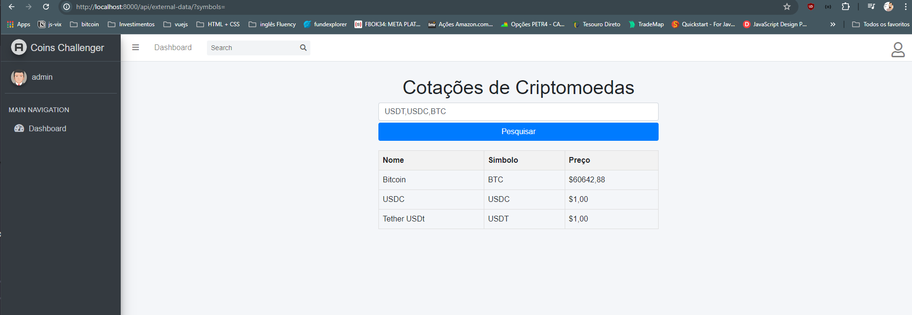
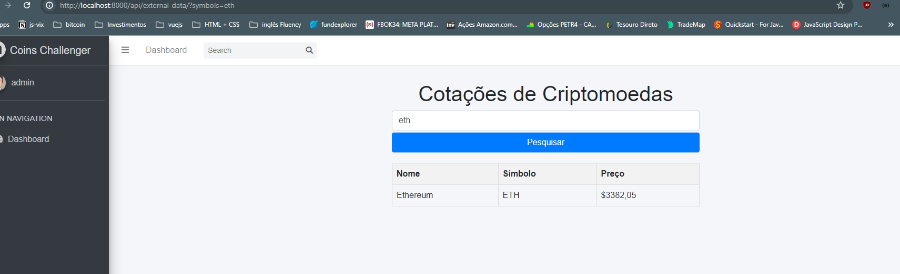

# Coins.ph Challenger


## This application was created using Docker, Django and Postgres!

## Screen shots

Tela de Login


Dashboard


Filtro


### commands:

- To upload this application locally, simply run the following docker command

  ```bash
    docker-compose up --build -d
  ```

During Docker execution, the application will create migrations, static files and generate the user **Admin** with password **123**.

## .env

you need to create a `.env` file inside the `dotenv_files` folder, you can use the `.env_example` file as a guide